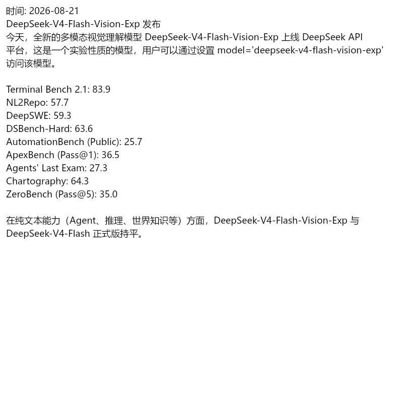

# dsh-text2img-compress

> **Text-as-image input token compression for DeepSeek Harness** — pack long user messages into text-rendered images so the vision model reads them at **384 tokens per image** instead of thousands of text tokens.

A [DeepSeek Harness](https://github.com/deepseek-ai/deepseek-harness) plugin. A **「图」toggle** appears next to the composer's input bar. When enabled, long user messages (≥ threshold, default 600 chars) are rendered into text images (800×800 pages, exactly at the 384-token cap) and sent to the model instead of raw text — the model still sees the full content (every character is inside the images), while the input drops from tens of thousands of tokens to a few hundred or thousand. Two direct benefits follow:

- **① input tokens drop ~4–5×, and so does the cost** — the conversation prefix before the message stays byte-identical, so **prompt-cache hits are unaffected**;
- **② the context-window footprint shrinks dramatically** — the same window can carry dozens of times more content, leaving room for instructions, reasoning steps, and tool results, so long documents no longer get truncated and the model performs more reliably.

[中文 README](./README.md) · [npm](https://www.npmjs.com/package/dsh-text2img-compress)

## Example

A rendered page as produced by the plugin (800×800 original, 18px, billed as **384 tokens**):



## How it works

DeepSeek's vision API bills images at a fixed rate (see the official [image understanding guide](https://api-docs.deepseek.com/guides/vision/)):

- every image is auto-scaled before inference — larger images shrink to ~800×800-equivalent pixels;
- each image's token count is **capped at 384** (a 2000×2000 and a 5000×5000 image cost the same once scaled);
- multiple images are billed per image, independently.

So raw text costs *N* tokens, while the same content rendered as 800×800 pages costs **384 per page**.

**Measured (2026-08, `deepseek-v4-flash-vision-exp`, 18px):** the DeepSeek changelog (~9,000+ chars, full of dates, benchmark scores, model names, URLs) rendered to **7 pages ≈ 2,688 tokens vs ~10,000+ as text — about 4–5× compression**. Smaller fonts pack more (16px ≈ 1,600 chars/page, 18px ≈ 1,250 chars/page for CJK); the page cap defaults to **10** (configurable 1–20 in settings).

## Install

```powershell
# With the DSH CLI:
dsh plugin --profile web add dsh-text2img-compress@0.1.0

# Or directly:
npm install dsh-text2img-compress
```

Restart DSH and refresh the page — the **「图」** button appears at the right end of the composer tool row, next to the send button.

> Requires a **vision model** (e.g. `deepseek-v4-flash-vision-exp`). When the active model name does not contain `vision`, the plugin skips conversion automatically (so text-only models never receive image blocks and error out).

## Usage

1. Click **「图」** — it becomes **「图·开」** (state is persisted via DSH settings; survives restarts);
2. Optional font size selector next to it: 14/16/18/20/22/24 px (**larger = more readable, fewer chars per page**);
3. Send text ≥ 600 chars (default) — the chat shows a hint line plus the rendered image pages;
4. The model reads the images directly; the full original text (including any instruction you wrote, e.g. "复述以下内容：") is inside the images.

Settings namespace `text2img` (editable in **DSH settings → "文本转图压缩 · Text-as-Image" page**):

| Field | Default | Range | Meaning |
| --- | --- | --- | --- |
| `enabled` | `false` | boolean | master switch (same as the 「图」button) |
| `fontPx` | `18` | 14–28 | font size: larger = more readable, fewer chars/page |
| `threshold` | `600` | ≥100 | minimum chars to convert; shorter messages stay text |
| `maxPages` | `10` | 1–20 | max image pages (DSH admits up to 20 images/message); beyond that it falls back to plain text |

## When to use / when not

**✅ Good for** (approximate/high-fidelity reading):

- long docs, papers, manuals, changelogs — summarization, Q&A, retrieval;
- context-window budget compression (a 100 KB doc goes from 30k+ tokens to a few thousand);
- content that needs to be reproduced at high fidelity (dates, numbers, paragraph meaning).

**⚠️ Not for** (needs exact characters):

- code, config, SQL, JSON — one wrong character breaks everything; keep sending those as text;
- very long texts (beyond `maxPages`, default 10 pages ≈ ~13k chars @18px; configurable 1–20) — the plugin **falls back to plain text** rather than truncating;
- tiny fonts or heavily structured layouts (tables, formulas).

**Accuracy note:** a general vision model is not an OCR engine. Pick the font size for your use case — 18px is the default compromise; use 22px for precision, 16px for maximum savings. Run `bench/` to measure on your own content.

## Implementation

- **Host**: listens to `agent/pre-step` (the official waterfall that decides which messages enter a model step). For user messages with a single text block, length ≥ threshold, and a vision model active, it renders the text to 800×800 PNG pages with `@napi-rs/canvas`, persists them through `attachments.saveImages`, and swaps the text block for `ImageBlock`s. **Every failure falls back to plain text** — nothing is ever dropped, and the agent loop is never interrupted.
- **Client**: the `conversation.input.right` slot hosts the toggle + font selector; state is written to DSH settings (`ctx.settingsScope.bind`) and shared with the host through the same namespace — no custom RPC needed.
- Zero custom client↔host remote: state goes through `settings`; rendering and swap happen in the host via standard services.

## Development

```powershell
pnpm install
pnpm build          # tsc (host + client types) + tsdown (client bundle)
pnpm typecheck
```

Layout:

```
src/index.ts      Host plugin (settings + agent/pre-step swap)
src/render.ts     text → 800×800 PNG pages (@napi-rs/canvas, word-boundary wrap)
src/ui/index.ts   Client plugin (「图」toggle + font selector)
cordis.patch.yml  composition patch (one insert row)
```

## License

MIT
