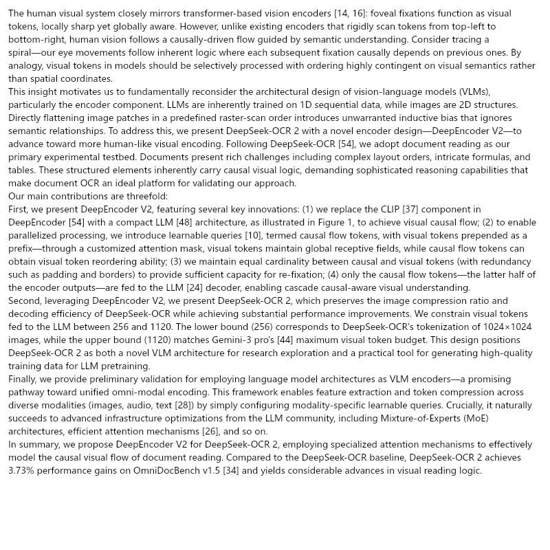

# dsh-text2img-compress

A [DeepSeek Harness](https://github.com/deepseek-ai/deepseek-harness) plugin. A **「图」toggle** appears next to the composer input bar. When enabled, long user messages (≥ threshold, default 600 chars) are rendered into text images (800×800 pages) before they reach the model — DeepSeek's vision API bills **at most 384 tokens per image**, so long documents drop from tens of thousands of input tokens to a few hundred or thousand, with the full text preserved inside the images. Two direct benefits:

- **① Input tokens drop ~2–2.5× for CJK (more at smaller fonts), cutting cost** — the conversation prefix before the message stays byte-identical, so **prompt-cache hits are unaffected**;
- **② The context-window footprint shrinks dramatically** — the same window carries far more content, leaving room for instructions, reasoning steps, and tool results.

[中文 README](./README.md) · [npm](https://www.npmjs.com/package/dsh-text2img-compress)

## Example

The image below is the Introduction of DeepSeek-OCR 2 ([arXiv 2601.20552](https://arxiv.org/pdf/2601.20552)):
**3,873 chars = 767 tokens** as text (DeepSeek-V3 tokenizer); at **13px it fits one 800×800 page = 384 tokens**:



| Content | Text tokens | 13px | 18px |
| --- | --- | --- | --- |
| Chinese 《端午咸》 | 804 | 1 page = 384 (**2.1×**) | 1 page = 384 (**2.1×**) |
| English introduction (DeepSeek-OCR 2, 3,873 chars) | 767 | 1 page = 384 (**2.0×**) | 2 pages = 768 (**0.96×, no gain**) |
| Chinese long text: Lu Xun's《故乡》(4,974 chars) | 3,409 | 3 pages = 1,152 (**3.0×**) | 5 pages = 1,920 (**1.8×**) |

> Length × font size: for the same Chinese text, the 4,974-char story costs **40% less at 13px than at 18px** (1,920 → 1,152 tokens). A short text often does not fill a page (both sizes then cost the same); once it spans multiple pages, page capacity (≈2,300 chars at 13px vs ≈1,250 at 18px) drives the ratio.

> Notes: English at ≥18px gains essentially nothing (≈5 chars/token as text vs ≈5.9 chars per image token) — use 13px (~2×) or plain text; Chinese at 18px is ~2.1–2.5×, improving with length and smaller fonts.

## How it works

DeepSeek's vision API bills images at a fixed rate (official [image understanding guide](https://api-docs.deepseek.com/guides/vision/)):

- every image is auto-scaled before inference — larger images shrink to ~800×800-equivalent pixels;
- each image's token count is **capped at 384** (a 2000×2000 and a 5000×5000 image cost the same once scaled);
- multiple images are billed per image, independently.

So raw text costs *N* tokens, while the same content rendered as 800×800 pages costs **384 per page**.

Measured (`deepseek-v4-flash-vision-exp`, 18px): 《端午咸》 **1,036 chars = 804 tokens** (DeepSeek-V3 tokenizer) → **1 page = 384 tokens (~2.1×)**. Real gains depend on font size and language: CJK ~2–2.5× at 18px, ~4.6–6× at 12–13px (≈2,300–2,900 chars/page); English ~1–2× (≈5 chars/token as text vs ≈5.9 chars per image token). The page cap defaults to **10** (configurable 1–20).

## Install

```powershell
# With the DSH CLI:
dsh plugin --profile web add dsh-text2img-compress@0.1.3

# Or directly:
npm install dsh-text2img-compress
```

Restart DSH and refresh the page — the **「图」** button appears at the right end of the composer tool row, next to the send button. Requires a **vision model** (e.g. `deepseek-v4-flash-vision-exp`); when the active model name does not contain `vision`, the plugin skips conversion automatically.

## Usage

1. Click **「图」** to toggle — state persists across restarts;
2. Optional font size selector: **12–22 px in 1px steps** (smaller = more chars per page, up to ~6× on long CJK text);
3. Send text ≥ 600 chars (default) — the chat shows a hint line plus the rendered image pages;
4. The model reads the images directly; the full original text is inside them.

Settings namespace `text2img` (editable in **DSH settings → "文本转图压缩 · Text-as-Image"**):

| Field | Default | Range | Meaning |
| --- | --- | --- | --- |
| `enabled` | `false` | boolean | master switch (same as the 「图」button) |
| `fontPx` | `18` | 12–22 (1px steps) | font size: larger = more readable, fewer chars/page |
| `threshold` | `600` | ≥100 | minimum chars to convert; shorter messages stay text |
| `maxPages` | `10` | 1–20 | max image pages (DSH admits up to 20 images/message); beyond that it falls back to plain text |

## When to use / when not

**Use for**: long docs, papers, manuals, changelogs — understanding, summarization, Q&A, retrieval; context-window budget compression (a 100 KB doc drops from 30k+ to a few thousand tokens); content that needs high-fidelity reproduction (dates, numbers, paragraph meaning).

**Not for**: code, config, SQL, JSON (one wrong character breaks everything — send those as text); very long texts (beyond `maxPages`, default 10 pages ≈ ~13k chars @18px; configurable 1–20) — the plugin **falls back to plain text** rather than truncating; heavily structured layouts at tiny fonts (tables, formulas).

**Accuracy**: a general vision model is not an OCR engine — pick the font size for your use case: 18px is the default compromise, 22px for precision, 12px for maximum savings. Measure on your own content with `bench/`.

## Implementation

- **Host**: listens to `agent/pre-step` (the official waterfall that decides which messages enter a model step). For user messages with a single text block, length ≥ threshold, and a vision model active, it renders the text into 800×800 PNG pages with `@napi-rs/canvas`, persists them through `attachments.saveImages`, and swaps the text block for `ImageBlock`s. **Every failure falls back to plain text** — nothing is dropped, the loop is never interrupted.
- **Client**: the `conversation.input.right` slot hosts the toggle + font selector; state goes through DSH settings (`ctx.settingsScope.bind`) and is shared with the host via the same namespace.
- Zero custom RPC: settings for state; standard host events and the attachment service for rendering and swap.

## Development

```powershell
pnpm install
pnpm build          # tsc (host + client types) + tsdown (client bundle)
pnpm typecheck
```

```
samples/            sample texts for README examples (public domain / official DeepSeek demos)
src/index.ts        Host plugin (settings + agent/pre-step swap)
src/render.ts       text → 800×800 PNG pages (@napi-rs/canvas, word-boundary wrap)
src/ui/index.ts     Client plugin (「图」toggle + font selector)
cordis.patch.yml    composition patch (one insert row)
```

## License

MIT
