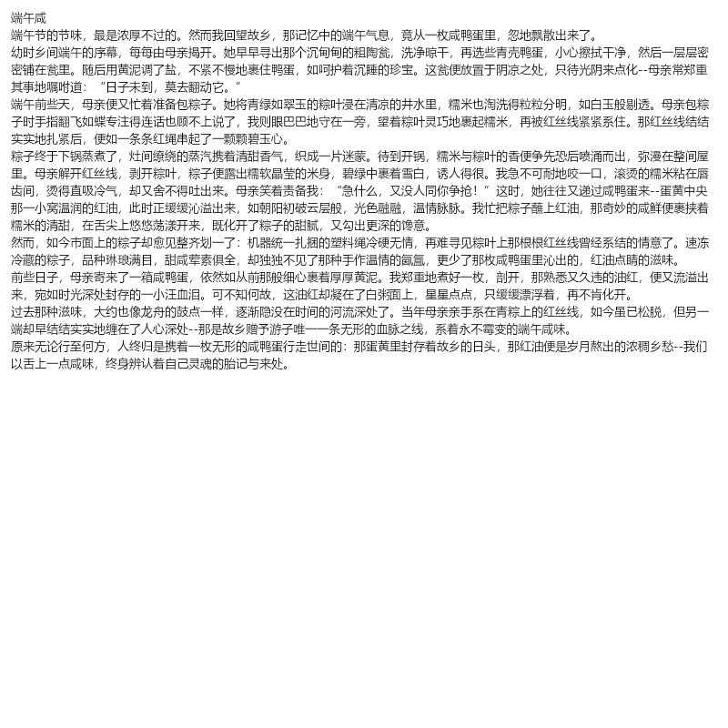

# dsh-text2img-compress

> `dsh-text2img-compress` — 把**长文本渲染成图片**发送给 DeepSeek 视觉模型，
> 利用 **每张图片 384 token 封顶** 的计费规则压缩输入 token（**text-as-image token compression**）。

[English](./README.en.md) · [npm](https://www.npmjs.com/package/dsh-text2img-compress)

## 效果示例

下图即 DeepSeek 官网中文写作示例《端午咸》（[news250528](https://api-docs.deepseek.com/zh-cn/news/news250528)），
**1,036 字 = 804 token**（DeepSeek-V3 tokenizer 实测），默认 **18px 渲染为单张 800×800 = 384 token**：


同文 13px 版：

| 内容 | 文本 token | 13px | 18px |
| --- | --- | --- | --- |
| 中文《端午咸》 | 804 | 1 页 = 384（**2.1×**） | 1 页 = 384（**2.1×**） |
| 英文论文摘要（3,873 字符） | 767 | 1 页 = 384（**2.0×**） | 2 页 = 768（**0.96×，无收益**） |
| 中文长篇：鲁迅《故乡》全文（公有领域） | 3,409 | 3 页 = 1,152（**3.0×**） | 5 页 = 1,920（**1.8×**） |

> 篇幅×字号 的直接证据：同是中文，**4,974 字的长篇在 13px 下比 18px 再省 40%**（1,920 → 1,152 token）——
> 因为一篇短文往往连一页都填不满（此时 13px 与 18px 同为 1 页、无差别），而**篇幅一长，
> 页面容量（13px 每页约 2,300 字 vs 18px 约 1,250 字）才开始真正决定压缩比**。

> 诚实说明：
> - **英文 18px 压缩几乎无收益**——英文每 token ≈ 5 字符，与 18px 图片每 token 约 5.9 字符相当；
>   英文建议 13px（约 2×）或直接用文本；
> - **中文 18px 约 2.1~2.5×**，且**字数越长、字号越小，中文优势越大**（13px 每页约 2,300 字 → 长篇约 4.6×）；
>   本文仅 1,036 字、填不满一页，所以 13px 与 18px 同为 1 页——篇幅充足时两种字号的差异才会显现。

一个 [DeepSeek Harness](https://github.com/deepseek-ai/deepseek-harness)（DSH）插件：
输入框右侧出现「图」开关，开启后，**超过阈值的长消息**在发送给模型前会被自动渲染为
文字图片（每张 800×800，恰好吃掉 384 token 上限）；模型看到的输入从上万 token 降到
**几百到几千**，而内容一字不差（所有文字都在图里）。由此带来两点直接收益：

- **① 输入 token 大幅下降（中文约 2~2.5×、小字号更高），成本随之降低**——消息之前的对话前缀逐字节不变，
  **而缓存命中不会因此降低**；
- **② 上下文窗口占用大幅压缩**——同样的窗口能装下几十倍内容，为指令、推理步骤与工具结果
  留足空间，长文档场景不再轻易被截断，模型表现更稳定。

## 原理

DeepSeek 视觉 API 对输入图片有固定计费规则（[官方文档](https://api-docs.deepseek.com/zh-cn/guides/vision/)）：

- 每张图片进入模型前自动缩放：更大图片等比缩到总像素约 **800×800** 等效；
- **每张图片 token 数存在上限：384 个** —— 2000×2000 和 5000×5000 的图，缩放后一样是 384；
- 多张图每张独立计费。

对长文本：**按文本发 → N 个 token；渲染成 800×800 的图 → 每 384 token/[页]**。

实测（`deepseek-v4-flash-vision-exp`，18px）：以《端午咸》（见上方示例图）为例——
**1,036 字 = 804 token**（DeepSeek-V3 tokenizer 实测）→ **1 页 = 384 token（约 2.1×）**。
真实增益取决于字号与语言：中文 18px 约 2~2.5×、12~13px 约 4.6~6×（每页约 2,300~2,900 字）；
英文正文约 1~2×（每 token ≈ 5 字符 vs 图片每 token 约 5.9 字符）。页数上限默认 **10**
（可在设置中调为 1–20）。

## 安装

```powershell
# 有 DSH CLI：
dsh plugin --profile web add dsh-text2img-compress@0.1.1

# 或直接 npm 安装：
npm install dsh-text2img-compress
```

然后重启 DSH、打开/刷新页面：输入框右侧、发送按钮左边出现「图」按钮。

> 需要当前模型是**视觉模型**（如 `deepseek-v4-flash-vision-exp`）；模型名不含 `vision` 时
> 插件自动跳过转换（避免给纯文本模型发图片块导致报错）。

## 使用

1. 点击「图」→ 变为「图·开」（状态持久化，重启不丢）；
2. 旁边可选字号 12–28px（**1px 步进**；越小越易读上限降低、每页字数越少，10 页上限内最省 token）；
3. 发送 **≥ 默认 600 字** 的文本 —— 聊天里显示一条提示 + 文字图片；
4. 模型直接读取图片内容（图中包含全部原文，含你写的指令，如"复述以下内容："）。

设置项（settings 命名空间 `text2img`，也可在 **DSH 设置面板 →「文本转图压缩」页** 编辑）：

| 字段 | 默认 | 范围 | 含义 |
| --- | --- | --- | --- |
| `enabled` | `false` | 布尔 | 总开关（等价于输入框右侧「图」按钮） |
| `fontPx` | `18` | 12–28（1px 步进） | 字号：越大越易读、每页字数越少 |
| `threshold` | `600` | ≥100 | 最小字符数：更短的消息保持纯文本 |
| `maxPages` | `10` | 1–20 | 最多图片页数（DSH 附件上限 20 张/消息）；超出自动回退纯文本 |

## 适用 / 不适用

**✅ 适用**（"读懂大意/高保真阅读"）：

- 长文档/论文/手册/更新日志的理解、总结、检索；
- 长上下文窗口的预算压缩（100KB 文档从 3 万+ token 降到几千）；
- 需要大致还原内容的场景（日期、数字、段落大意）。

**⚠️ 不适用**（需要**逐字精确**）：

- 代码、配置、SQL、JSON（一个字符错就全错）—— 请用文本发送；
- 超长文本（超过 `maxPages` 默认 10 页 ≈ 约 13,000 字 @18px；可在设置中调到 1–20）：插件会**自动回退纯文本**，绝不截断；
- 小图/极小字号下的复杂排版（表格、公式）。

**准确率提示**：通用视觉模型不是 OCR 专用模型。建议根据实测选择字号——
18px 是压缩与可读性的折中；对精度要求高用 22px，对预算极端敏感用 16px。

## 工作原理（实现）

- **Host**：监听 `agent/pre-step`（官方 waterfall），把进入模型的用户消息中
  单个文本块、≥ 阈值、当前模型为视觉模型的，用 `@napi-rs/canvas` 渲染成 800×800 PNG 页，
  经 `attachments.saveImages` 落盘为 `ImageBlock` 后替换原文本块；
  任何失败都**回退纯文本**，绝不丢内容、不中断会话。
- **Client**：`conversation.input.right` 槽位注入「图」开关 + 字号下拉；
  状态通过 DSH settings（`ctx.settingsScope.bind`）持久化，与 Host 共享同一命名空间。
- 零自定义 RPC：开关/字号走 settings；渲染/替换走宿主事件与附件服务。

## 开发

```powershell
pnpm install
pnpm build       # tsc (host+types) + tsdown (client bundle)
pnpm typecheck
```

结构：

```
src/index.ts      Host 插件（settings + agent/pre-step 替换）
src/render.ts     文本 → 800×800 PNG 页（@napi-rs/canvas，词边界换行）
src/ui/index.ts   Client 插件（「图」开关 + 字号下拉）
cordis.patch.yml  组合补丁（一行 insert）
```

## License

MIT
